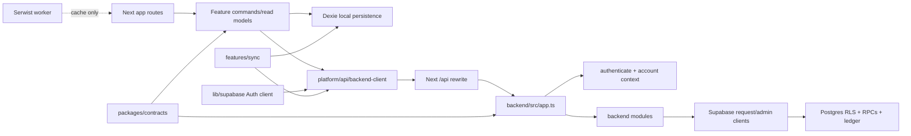
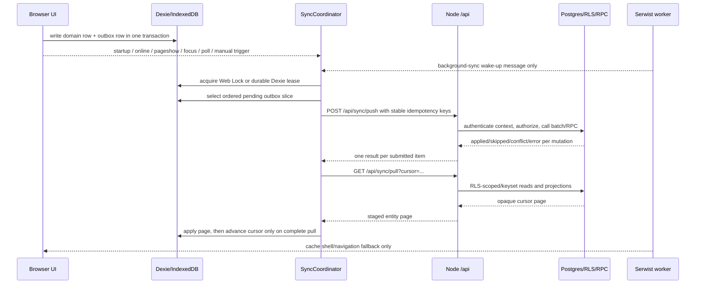

# OjàPadi architecture audit and boundary cleanup

Audit date: 2026-10-07. Evidence is from the current working tree on `main`.
The untracked backend tests present before this pass were preserved.

This audit serves TRUST promises 1, 2, 6, and 8: local writes remain durable,
retries cannot duplicate mutations, offline work has one sync owner, and
authorization has one authoritative server/database path. Evidence is the
existing sync/RLS test suites plus the boundary tests listed at the end.

## 1. Current architecture map

```text
frontend/
  src/app/                         Next.js App Router routes and shells
  src/features/                    Product behavior, local commands, sync, auth
  src/components/                  Shared UI and state presentation
  src/platform/api/                Canonical Node API transport
  src/lib/db.ts                    Dexie schema and local persistence owner
  src/lib/supabase.ts              Browser Supabase Auth client owner only
  src/config/                      Branding, business types, limits
  src/types/                       Frontend/domain and wire type adapters
  src/app/sw.ts                    Serwist app-shell/navigation service worker

backend/
  api/index.ts                     Vercel adapter for the Node HTTP application
  src/app.ts                       Route dispatch, body limits, CORS, errors
  src/middleware/                  Bearer-token authentication
  src/modules/                     Auth, account, authorization, domain, sync
  src/shared/supabase/client.ts    Admin and request-scoped Supabase clients
  src/shared/contracts.generated.ts generated copy of shared contracts

packages/contracts/
  src/index.ts                     Shared capabilities, sync wire types, errors

supabase/
  migrations/                      Schema, RLS, authoritative RPCs, ledger rules
  functions/                       Legacy URL compatibility adapters
  __tests__/                       PGlite migration, RLS, and RPC evidence
```

The directory layout is intentionally feature-oriented. No mechanical
`domain/` or `infrastructure/` tree was added: `features/`, `platform/`,
`modules/`, and `shared/` already express the important ownership boundaries.

## 2. Current dependency graph



Important allowed directions:

- UI routes may call feature commands and read models; feature code does not
  import UI components.
- Feature application code may use local persistence and the platform API.
- The platform API may use the Auth client to obtain/refresh a bearer token;
  it does not write business data directly.
- Backend modules may use shared Supabase clients; database code does not
  depend on React or browser state.
- Supabase Functions proxy only; they are not imported by the frontend.

## 3. Current runtime/data-flow diagram



When local and server state disagree, Postgres wins. A local event is not
discarded before a per-item server acknowledgement, and stock-affecting
acknowledgements remain visible until the pull confirms the server projection.

Realtime is not currently implemented as a browser data path: there are no
active browser channel subscriptions. The current invalidation fallback is
online/reconnect/auth/focus plus bounded foreground polling. Realtime can be
added later as an invalidation hint, never as a replacement for cursor pull.

The pull cursor is an opaque server-generated watermark plus per-dataset
keyset positions. It is ordered by server timestamps and stable row IDs, never
by a client clock. Pages are staged and the completed cursor is persisted only
after the staged records have been applied. An empty page is a successful
convergence result.

`frontend/src/features/sync/SyncCoordinator.ts` is the canonical coordinator;
`SyncEngine.tsx` is only its React lifecycle adapter. It owns single-flight
execution, triggers, recovery, push-before-pull ordering, runtime state, and
cross-tab coordination. The service worker only requests a foreground wake-up.

## 4. Duplicated responsibilities

| Responsibility | Current locations | Decision |
|---|---|---|
| Browser HTTP transport | `src/platform/api/backend-client.ts`, compatibility `features/operations/server-client.ts` | One implementation; old file is re-export only. Migrate imports to `platform/api`. |
| Auth state | Supabase Auth client, Dexie `session`/`localUsers`, backend JWT/context | Deliberate split: Supabase owns credentials/token; backend owns authorization; Dexie owns local rendering gate/cache. |
| Sync retry | `features/sync/SyncCoordinator.ts`, `drain-outbox.ts`, `preload-session-data.ts` | One application owner. Serwist has no mutation replay; enqueue only requests a wake-up. |
| Sync merge | Node `modules/sync`, database `sync_apply_*`/`sync_apply_batch` | Deliberate two-stage authority: Node authenticates/authorizes; SQL commits ledger/RLS-safe state. |
| Historical Function URLs | `supabase/functions/*`, Node routes | Compatibility transport only; no second business implementation. Remove after traffic evidence. |
| Local persistence | `lib/db.ts` plus feature modules/pages | `lib/db.ts` is the schema owner; feature commands own transactional writes. Registration/onboarding pages remain a migration target. |
| Email assets | `backend/src/shared/email`, `supabase/functions/_shared` | Required runtime copies while adapters exist; treat as one compatibility surface and test both when changing copy. |
| Supabase clients | admin client and request-scoped access-token client | Admin is reserved for trusted context/RPC operations; ordinary reads should use the request-scoped client. Remaining legacy admin-read call sites are risk items. |

## 5. Architectural contradictions found

1. **Authority wording:** code used Node `/api` for business traffic, while the
   frontend package description, frontend README, and older product docs said
   Supabase + Edge Functions. Resolved in current docs and ADR.
2. **Runtime:** package manifests said Node 24.x; README said Node 22+ and the
   nested frontend workflow used Node 20. Resolved to Node 24.x with `.nvmrc`,
   `.node-version`, npm metadata, package locks, and both workflows.
3. **Service-worker vocabulary:** docs/UI said Workbox while code uses Serwist.
   Current implementation story is Serwist caching only; the outbox remains in
   the application sync engine.
4. **Workspace topology:** root `packages/*` is a real shared workspace;
   frontend, backend, and Supabase are separately locked/deployed packages.
   Root scripts orchestrate them and do not imply a single workspace.
5. **Missing source documents:** the referenced rebranding and backend-split
   documents were absent. Pointers were added without inventing a second set
   of rules; the canonical rules and topology are now explicit.
6. **Shared contracts:** sync route constants and wire request types were
   duplicated or implicit. They now live in `packages/contracts` and are
   generated into the backend build boundary.
7. **Deployment topology:** a root `vercel.json` described a composite service
   while the documented deployment uses separate frontend and backend Vercel
   projects. The composite manifest was removed; each deployable keeps its own
   configuration and the root remains orchestration-only.
8. **Sync liveness:** the previous coordinator and pull loader treated the
   unreliable `navigator.onLine` hint as an authority and could suppress a
   reachable backend attempt. The gate is removed; transport errors now drive
   persisted retry state.
9. **Cross-tab recovery:** the previous sweeper reset every non-confirming
   `syncing` row, including rows another tab had just sent. Recovery is now
   age-based and the coordinator uses Web Locks with an additive Dexie lease.
10. **Service-worker ownership:** Background Sync only posts a wake-up message
    to a client. It never replays business mutations or becomes a second
    authentication/idempotency owner.

## 6. Risky modules

| Module | Risk | Containment/evidence |
|---|---|---|
| `frontend/src/lib/db.ts` | Schema upgrades or tenant filtering can strand or mix local data. | Additive Dexie migrations, tenant tests, backup/restore tests. |
| `frontend/src/features/sync/drain-outbox.ts` | Incorrect acknowledgement/retry can lose or duplicate sales. | Per-item results, stable idempotency keys, sync tests, two-device ledger tests. |
| `frontend/src/features/sync/preload-session-data.ts` | Advancing a cursor before complete apply can permanently skip remote data. | Staged apply and cursor-after-success behavior, pull tests. |
| `backend/src/modules/sync/sync.service.ts` | Authorization or RPC classification errors affect every offline mutation. | Backend sync tests plus Supabase batch/RLS suites. |
| `backend/src/app.ts` | A route dispatch/body/CORS regression affects all API behavior. | App and Vercel handler tests. |
| `frontend/src/features/auth/AuthProvider.tsx` and backend account context | Local cached identity could be mistaken for server authorization. | ADR; backend always verifies JWT/context and database enforces RLS. |
| `frontend/src/app/sw.ts` | A service worker could accidentally become a second mutation owner. | Serwist test asserts cache/lifecycle config and source has no push replay. |
| Legacy backend admin-read call sites | A service-role read can bypass RLS defense in depth if tenant filters regress. | Keep explicit business filters; migrate to request-scoped clients in follow-up. |
| Registration/onboarding route pages | Pages contain Dexie transactions and outbox orchestration. | Existing flow tests; next migration extracts feature commands without changing behavior. |

## 7. Proposed target architecture

```text
frontend/src/
  app/                         route composition and server/client boundaries
  features/<area>/             domain-facing commands, read models, UI
  platform/api/                backend transport and error normalization
  lib/db.ts                    Dexie schema/persistence owner (legacy-stable path)
  lib/supabase.ts              Auth SDK owner only
  config/                      branding/business-type/runtime config
  components/                  presentation primitives

backend/src/
  app.ts                       HTTP composition and cross-cutting policy
  middleware/                  token authentication
  modules/<area>/              route/controller/application logic
  shared/supabase/             database clients
  shared/contracts.generated   build-time contract boundary

packages/contracts/src/         cross-process wire types, routes, capabilities
supabase/migrations/            SQL schema/RLS/RPC authority
supabase/functions/             compatibility adapters only
```

The target is an ownership model, not a wholesale folder rewrite. Domain rules
remain in feature/application modules and backend modules; React stays at the
UI edge; Dexie stays behind local application commands; infrastructure does not
flow into domain-only functions.

## 8. File-by-file migration plan

### Completed in this pass

- `package.json`, all package manifests, package locks, `.nvmrc`, and
  `.node-version`: one Node 24.x/npm 11 runtime contract.
- `.github/workflows/ci.yml` and `frontend/.github/workflows/ci.yml`: Node 24.
- `frontend/src/platform/api/backend-client.ts`: canonical browser-to-Node
  transport, auth refresh, timeout, and error normalization.
- `frontend/src/features/operations/server-client.ts`: compatibility re-export;
  no second implementation.
- Runtime feature/page imports and related transport mocks: migrated to the
  platform boundary.
- `packages/contracts/src/index.ts`, generated backend contracts, and
  `frontend/src/types/sync.ts`: shared sync route/wire types.
- `frontend/src/app/sw.ts`, package descriptions, READMEs, architecture rules,
  PRD diagram/API text, and `docs/ARCHITECTURE-AUDIT.md`: canonical vocabulary.
- `docs/adr/0001-canonical-application-flow.md`: accepted authority decision.
- `vercel.json`: removed the redundant root composite deployment definition;
  `backend/vercel.json` and the frontend project root remain the deployment
  configuration boundaries.
- `frontend/src/features/sync/SyncCoordinator.ts`: canonical single-flight
  lifecycle with startup, reconnect, pageshow, focus, polling, manual, auth,
  and service-worker wake-up triggers.
- `frontend/src/features/sync/sync-lease.ts` and the additive Dexie version 16:
  Web Locks plus durable lease fallback without changing existing outbox data.
- `frontend/src/features/sync/drain-outbox.ts`: 408/5xx/429 classification,
  jittered retry, device identity, malformed-response recovery, and safe stale
  `syncing` recovery.
- `frontend/src/features/sync/sync-observability.ts` and Sync Health: safe
  session/batch/oldest-operation diagnostics without payloads or credentials.

### Follow-up, intentionally not a behavior rewrite

- Extract registration and onboarding local transactions into feature commands;
  retain page adapters until flow tests cover parity.
- Migrate remaining legacy backend service context lookups and ordinary reads
  away from the admin client where the current RPC/RLS contract permits it.
- Add deployment traffic evidence for each compatibility Function before
  deleting it.
- Add a browser E2E test for server/client auth refresh and a real-device
  offline round trip, as required by `testing-and-qa.md`.

## 9. Dependency/move sequence

1. Freeze the authority decision and record it in the ADR.
2. Align runtime/package/deployment documentation and verify Node 24 locally.
3. Establish `platform/api` as the only browser business transport; retain the
   old module as a re-export until consumers move.
4. Move feature imports and test mocks to the canonical transport.
5. Promote sync routes/request types into shared contracts and regenerate the
   backend copy.
6. Keep local writes, outbox, sync orchestration, and pull application in their
   current feature owners; do not cross a server/client boundary during a
   mechanical move.
7. Extract page-level local transactions one feature at a time, running the
   relevant flow tests after each extraction.
8. Migrate ordinary server reads to request-scoped Supabase clients and run
   authorization/RLS tests.
9. Retire compatibility adapters only after production traffic is zero and a
   rollback window has passed.

## 10. Risk assessment and rollback plan

| Risk | Probability | Impact | Mitigation |
|---|---:|---:|---|
| Transport import migration changes mocked error identity | Medium | Medium | Compatibility re-export, migrated mocks, browser transport test. |
| Node runtime change exposes dependency incompatibility | Low | High | Node 24 is the existing manifest runtime; run install/typecheck/test/build for every package. |
| Documentation hides a still-live legacy caller | Medium | High | Keep adapters; require deployment traffic evidence before removal. |
| Contract drift between frontend and backend | Medium | High | Source contracts package plus generated backend copy and build scripts. |
| Local write extraction changes transaction membership | Medium | Critical | One feature at a time, preserve the exact Dexie transaction, add/retain flow tests. |
| Admin-client read migration changes RLS-visible rows | Medium | High | Separate change, role/tenant tests, no migration bundled with the move. |

Rollback is a source rollback, not a data rollback: revert the boundary/import
changes while leaving existing Dexie rows, outbox entries, migrations, and
ledger records untouched. The compatibility transport and old re-export make
the API/client changes independently reversible. No database migration is part
of this architecture cleanup.

## Verification matrix

The required verification commands are:

```text
npm run lint
npm run typecheck
npm test
npm run build
npm run backend:build
npm run supabase:test
```

Sync-specific evidence includes the frontend sync suite, backend sync service
tests, and all Supabase `sync_apply_*`, batch, ledger, and RLS suites. Any
environment-dependent or unexecuted check remains labelled unverified in the
handoff rather than being inferred from compilation.
