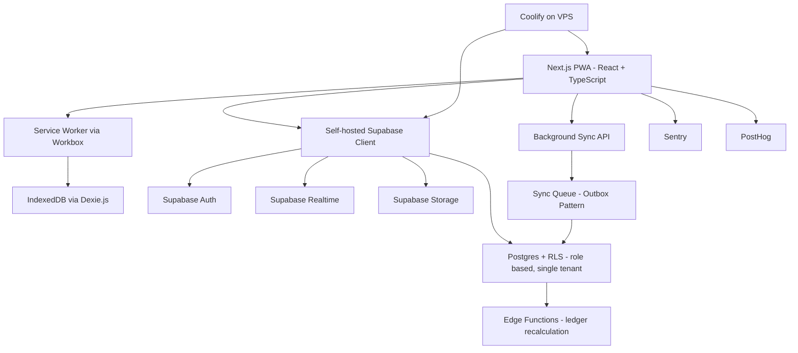
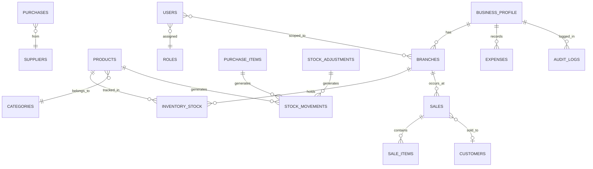

# PRD: StockPadi (working title)

## Offline-First Inventory & Sales Management PWA, Multi-Tenant Architecture

Version 1.0 | Status: Final draft for engineering review | Author: Product (developed via structured 5-role debate: PM, Enterprise Solutions Architect, Retail Technology Consultant, UX Strategist, Software Architect), backed by direct competitor and infrastructure research

---

## 1. Executive Summary

StockPadi is an offline-first inventory and point-of-sale PWA built for retail businesses with 1 to 6 branches, deployed on a multi-tenant shared database architecture via PostgreSQL Row Level Security (RLS). The product exists to close a gap the competitor research confirmed directly: Zoho Inventory has no offline mode in its core product at all, Loyverse and Square restrict what you can do while offline, and none of them are built around 2G reality the way this product is. The build is architected as a reusable multi-tenant core (configurable by business type) so that scaling to new clients requires zero infrastructure forks—just a new business profile.

## 2. Product Vision

One well-built inventory and sales core that behaves identically whether the client is running one till or six branches, works completely offline on a low-end Android phone, and can be reconfigured for a different retail vertical without touching the underlying architecture.

## 3. Deployment Context

Retail businesses with 1 to 6 branches, exact business category set via a configuration step at onboarding rather than hardcoded (Section 7.1). Olaflay hosts and maintains the deployment as a multi-tenant SaaS, using Supabase Postgres RLS to strictly isolate data by `business_id` across all clients.

Market context that shaped the architecture, not a go-to-market case since this isn't being sold to multiple businesses:

- Nigeria has roughly 87% mobile penetration, 66% smartphone penetration, and 86% of smartphone users are on Android.
- Two-thirds of Nigerian mobile users connect via 2G,  which is the reason offline behavior is treated as core architecture rather than a feature toggle.
- Konga's move to a PWA in this exact market cut first-load data usage by 92%,  the direct precedent for choosing a PWA over a native app here.
- Nigerian retail SMEs commonly report losing a substantial share of annual revenue to untracked stock loss and pricing errors,  which is the shrinkage problem the stock ledger in Section 11 exists to close.

## 4. Competitor Analysis

| Product | Offline behavior | Lesson applied to this build |
| --- | --- | --- |
| Moniebook (Moniepoint) | Offline sales with auto-sync on reconnect,  tied to Moniepoint's terminal and lending ecosystem | Confirms offline-first is the baseline expectation in this market |
| Loyverse POS | Refunds, new customer creation, and item edits disabled offline; won't allow logout with unsynced receipts | Direct precedent for restricting specific risky operations offline rather than trying to merge everything |
| Square POS | Offline card payments capped by value; no refunds on pending offline transactions | Architecture pattern adopted (idempotent client-generated transaction IDs) regardless of market relevance |
| Zoho Inventory | No offline mode in the core product | The specific gap this product is built to close |

## 5. Users

- **Owner/Manager.** Needs visibility across whichever branches they oversee, without needing to be on-site or online to see the previous day's numbers.
- **Cashier (per branch).** Needs checkout fast, one-handed, identical whether the branch's connection is up or down.
- **Inventory staff.** Handles stock receiving and adjustments, not necessarily sales visibility.

Exact headcount and role assignment per branch to be confirmed with the client during setup.

## 6. Core User Journeys

**Offline sale.** Scan or search a product, confirm quantity, tag the payment method, receipt generates locally, sale queues in the outbox, the next sale proceeds immediately regardless of sync state.

**Reconnect and sync.** Queued sales upload in order once connectivity returns, the stock ledger recalculates server-side, other devices on the same branch update via Realtime without a manual refresh.

**Cross-branch review.** Owner opens the app from any device, dashboard renders from cache instantly and refreshes as fresh data arrives, with the option to view a single branch or a consolidated total across all branches.

## 7. Functional Requirements (MVP)

### 7.1 Business-type setup

A short onboarding step where the owner picks a business-type template. This sets sensible defaults, not hard restrictions, and is the mechanism that keeps one core reusable across retail verticals without forking the codebase:

| Business type | Default categories | Expiry/batch tracking | Notes |
| --- | --- | --- | --- |
| Grocery/Supermarket | Food, household, beverages | Optional, off by default | High SKU count expected |
| Pharmacy/FMCG | Medicine, personal care | On by default, mandatory expiry date per batch | Regulatory pressure around expired stock |
| Electronics/Accessories | Devices, accessories, parts | Off | Serial number field more relevant than batch/expiry |
| General Retail | Blank, owner-defined categories | Off | Fallback for anything not matching the above |

### 7.2 Full MVP feature set

| Module | MVP scope | Deferred to V2+ |
| --- | --- | --- |
| Onboarding & Welcome | Business-type template selection, sample data seeding (products & stock) for immediate offline trial | Guided interactive walkthrough |
| Dashboard | Per-branch and consolidated view, today's sales, profit estimate, low-stock count, unsynced indicator, contextual coach-marks | Business health score |
| Alert Center | Consolidated feed for low-stock and expiring products, aggregated via layout badge | Push notifications for alerts |
| Products | Name, SKU, barcode, category, brand, unit, cost/sell price, stock per branch | Product variants (size/color matrix) |
| Bulk Operations | CSV import for products (auto-mapping categories and initial stock ledger), CSV exports for sales and products | Auto-scheduled exports |
| Multi-store | Up to 6 branches, independent stock and staff per branch, consolidated owner-level reporting | Stock transfers between branches |
| Barcode scanning | Camera-based browser integration (`@zxing/browser`) across POS and Product views | Bluetooth scanner pairing |
| Stock adjustments | Manual correction, mandatory reason code | Photo evidence attachment |
| Purchases and suppliers | PO creation, receiving against a branch, supplier balance tracking | Three-way match (PO vs receipt vs invoice) |
| Sales (POS) | Barcode/search checkout, discount, payment method tag (not live processing), hold/resume, void (online only) | Real card/wallet payment processing |
| Receipts | On-screen digital receipt, WhatsApp direct share, built-in Print support (thermal/A4) | Custom receipt branding |
| Customers | Contact info, running credit balance, printable statements | Loyalty points |
| Expenses | Category, amount, note, per branch or business-wide | Recurring expense automation |
| Reports | Daily/weekly/monthly, per-branch and consolidated, best/worst sellers, dynamic net profit margin calculation | Cashflow forecasting |
| Settings | Business profile, branch management, staff and access, static Help & Support page | Multi-currency |
| User management | Owner, Manager, Cashier, Inventory Staff, Accountant roles, scoped per branch; bottom navigation filtered to role permissions | Custom role builder |
| Authentication | Email/password + OTP verification and Google OAuth for first setup (online required); PIN for daily unlock (offline capable); user picker shown on devices with existing local users; sessions expire after 24 hours | Biometric login |
| Backup & Data | Full offline database backup/restore (JSON), CSV accounting exports | Point-in-time restore UI |
| Sync | Full offline operation for all of the above except void/refund | Multi-device real-time collaboration indicators |

## 8. Non-Functional Requirements

| Requirement | Target |
| --- | --- |
| Offline availability | 100% of MVP flows fully functional with zero network connection |
| Cold start (cached, 2G) | Under 3 seconds to interactive |
| Sync latency (on reconnect) | Queued transactions begin uploading within 5 seconds of connectivity detection |
| Device support | Android 8+, 2GB RAM minimum, Chrome/WebView; iOS Safari supported but not primary |
| Data footprint | Initial install under 5MB |
| Accessibility | WCAG 2.1 AA contrast and touch target size (minimum 44x44px) |
| Localization | English (Nigerian) at launch; currency and date format never hardcoded |
| Uptime | 99.5% target, tied to the hosting choice in Section 9 |

## 9. Technical Architecture



> **Superseded:** the hosting narrative and diagram below (self-hosted VPS via Coolify) reflect the original research. Actual hosting is now Vercel (app) + Supabase Cloud (backend) — see `.agents/rules/hosting-and-deployment.md`. Kept here as the historical record of why VPS was the original recommendation.

**Hosting decision.** Primary recommendation: self-hosted Supabase stack (Postgres, Auth, Realtime, Storage, Edge Functions) and the Next.js app, both deployed on a single VPS (Hetzner or DigitalOcean, 2GB RAM class) through Coolify for git-push deploys and automated backups. This was chosen after checking actual developer sentiment rather than defaulting to the managed-cloud option: when Supabase-alternative discussions on Reddit are sorted by votes, the consistent top recommendation is self-hosting on a cheap VPS rather than switching to a different managed platform,  and the full Supabase stack runs comfortably on a $10/month, 2GB RAM droplet.  This keeps the exact architecture already designed (same Postgres schema, same RLS roles, same Edge Function ledger logic), it changes only where it runs.

Fallback, if ops time is the scarcer resource than money: Render, managed Postgres plus a web service instance, Postgres starting around $7/month with real backups and point-in-time recovery on higher tiers,  no server maintenance required.

Considered and rejected: Vercel plus Supabase Cloud (the original default) was set aside mainly because of billing unpredictability at this workload size, not capability, bandwidth-driven bill spikes are a recurring, well-documented complaint  for a use case that doesn't need Vercel's edge-scaling strengths. PocketBase was considered and rejected because its SQLite foundation and simpler rule engine would require rebuilding the transactional ledger and RLS-based permission guarantees that Postgres already provides natively, not worth it to save a few dollars a month on a system handling another business's financial data.

**Reusability for future deployments.** Business name/branding and the business-type defaults from Section 7.1 stay in configuration. A new client deployment simply signs up through the app, creating a new isolated `business_profile` within the shared multi-tenant infrastructure.

## 10. Offline Strategy

### 10.1 Sync lifecycle

1. **Device provisioning (online required, one-time).** Staff logs in with email/phone and password, device receives a signed token and downloads a full snapshot of the branch's catalog, prices, and open customer balances into IndexedDB.
2. **Local-first writes.** Every action writes to IndexedDB immediately and updates the UI optimistically, while simultaneously appending to a local sync queue (outbox pattern).
3. **Background sync.** A Workbox-managed Background Sync registration fires on reconnect, even if the app isn't in the foreground, draining the queue in FIFO order with client-generated idempotency keys so a retried upload never double-counts a sale.
4. **Server-side merge.** An Edge Function receives each batch, applies the entity-specific conflict rule below, and commits inside a Postgres transaction.
5. **Downstream propagation.** Supabase Realtime pushes the resulting state to other online devices on the same branch or business.
6. **Failure handling.** Failed items retry with exponential backoff, capped at 5 minutes, surfacing in a "needs attention" queue after 24 hours of failure rather than retrying silently forever.

### 10.2 Conflict resolution rules

| Entity | Strategy | Why |
| --- | --- | --- |
| Stock quantity | Delta/additive merge via an append-only `stock_movements` ledger; current stock is always computed, never a stored mutable field | Two offline clerks selling the same item must both be honored; treating stock as an absolute value that gets overwritten causes silent overselling,  a documented pattern in retail offline sync specifically |
| Sales/receipts | Append-only, immutable once created | Removes the conflict entirely, there's nothing to merge if a record never changes after creation |
| Product name/price/description | Last-write-wins by field, with a version counter and a visible "changed while offline" notice on mismatch | Low stakes if lost, doesn't justify the complexity of a full merge strategy |
| Customer credit balance | Delta/additive merge, same reasoning as stock | Same overselling/overstating risk if treated as absolute |
| New customer/product creation offline | Allowed, client-generated UUID prevents ID collisions on sync | Low collision risk at this transaction volume, no reason to restrict it the way Loyverse does |
| Refunds/voids | Online-only, disabled in the UI while offline | Directly adopted from Loyverse's approach of disabling refunds offline,  reinforced by Square's identical restriction on pending offline payments |

### 10.3 Offline authentication

First login (account creation or signing into a new device) requires connectivity, supporting both Email+OTP and Google OAuth. Once the device has at least one local user cached in IndexedDB, the app routes to a user picker screen instead of the email/password form. The user selects their profile and enters their 4-digit PIN, which is validated against a locally cached, salted hash with no network round trip.

PIN sessions expire after 24 hours, bounding the exposure from a lost or stolen device. The 24-hour limit was chosen over the earlier 30-day limit to match the expected daily shift pattern in a retail environment: at the start of each day or shift, staff authenticate fresh.

Navigation tabs are filtered at runtime based on the authenticated user's role. A cashier sees only the Sell tab. Inventory staff see only the Products tab. Owners, managers, and admins see the full set. This filtering happens client-side from the cached local user record and adds no latency to page load.

### 10.4 Cached assets and failure recovery

Service worker precaches the app shell and the branch's product catalog images on the freshest available connection. If local storage quota is exceeded, the app shows a warning and blocks new offline writes rather than failing silently.

## 11. Database Design



| Table | Purpose |
| --- | --- |
| `business_profile` | Single settings row: name, branding, business-type template, currency |
| `branches` | Up to 6 rows, each with independent stock and staff |
| `users`, `roles` | Staff accounts and the Owner/Manager/Cashier/Inventory Staff/Accountant/Admin role set |
| `products`, `categories`, `brands`, `units` | Catalog and lookup tables |
| `inventory_stock` | Current stock per product per branch, computed from `stock_movements`, never hand-edited |
| `stock_movements` | Append-only ledger, source of truth for all stock changes, referenced by sales, purchases, and adjustments |
| `stock_adjustments` | Manual corrections with mandatory reason code |
| `sales`, `sale_items` | Immutable once created, per Section 10.2 |
| `purchases`, `purchase_items`, `suppliers` | Purchase orders and supplier balances |
| `customers` | Contact info and running credit balance |
| `expenses` | Category, amount, note, date |
| `receipts` | Generated receipt metadata for reprint/resend |
| `audit_logs` | Every sensitive action: voids, adjustments, role changes, PIN resets |
| `devices` | Registered device tokens, supports offline auth and push targeting |

No SaaS subscription/billing table currently exists in MVP, but the database uses a strict `business_id` multi-tenant structure on every core table to allow for future SaaS billing integrations.

## 12. API Design

REST over HTTPS, JSON, via Supabase's PostgREST layer for CRUD and custom Edge Functions for sync merge and reporting logic.

**Auth:** `POST /auth/v1/token` returns a JWT and refresh token; RLS enforces role-based access on every query.

**Pagination:** cursor-based, not offset, since offset pagination breaks under concurrent inserts from multiple syncing devices.

```
GET /rest/v1/products?order=updated_at.desc&limit=50&cursor={last_updated_at}
```

**Sync push:**

```
POST /functions/v1/sync-push
{
  "device_id": "uuid",
  "batch": [
    {
      "client_id": "uuid",
      "type": "sale",
      "payload": { "branch_id": "...", "items": [...], "payment_method": "cash" },
      "created_at_local": "2026-08-06T09:15:00Z"
    }
  ]
}
```

**Error format:**

```
{ "error": { "code": "STOCK_INSUFFICIENT", "message": "Not enough stock to complete this sale", "field": "quantity" } }
```

## 13. UX Requirements

Every primary screen (Dashboard, Products, POS, Reports) must handle: empty, loading (skeleton, not spinner, past 300ms), offline (persistent non-blocking banner), sync-in-progress, error (plain language plus retry), success (brief dismissible toast), permission-denied (explains which role is required), and no-data-matching-filter distinct from no-data-exists.

Onboarding is three screens maximum, starting with the business-type selection from Section 7.1, and the first product can be added before account setup is fully complete. Every primary action stays reachable one-handed, in the lower half of the screen, minimum 44px touch targets.

## 14. Security Requirements

| Action | Owner | Manager | Cashier | Inventory Staff | Accountant | Admin |
| --- | --- | --- | --- | --- | --- | --- |
| View sales | Yes | Yes | Own only | No | Yes | Yes |
| Process sale | Yes | Yes | Yes | No | No | Yes |
| Void/refund sale | Yes | Yes | No | No | No | Yes |
| Add/edit products | Yes | Yes | No | Yes | No | Yes |
| Stock adjustments | Yes | Yes | No | Yes | No | Yes |
| View reports | Yes | Yes | No | Limited | Yes | Yes |
| Manage expenses | Yes | Limited | No | No | Yes | Yes |
| Manage staff/roles | Yes | No | No | No | No | Yes |
| Change settings | Yes | No | No | No | No | Yes |
| View audit log | Yes | Limited | No | No | No | Yes |

PIN login for daily use, password required for Owner/Admin sensitive actions. Encryption at rest and in transit. Every void, adjustment, role change, and PIN reset writes to `audit_logs`. Auth endpoints rate-limited against PIN brute-forcing. Session tokens expire with silent refresh; device tokens expire after 30 days of no server contact.

## 15. Analytics & KPIs

Activation: first sale within 24 hours of setup. Retention: at least one sale logged in 6 of the last 7 days. Offline reliance: percentage of sales created while offline, a high number validates the core bet. Sync health: median time from offline sale creation to confirmed sync. All trackable per branch and business-wide.

## 16. Scalability

At 1 to 6 branches and an estimated 50-300 combined sales/day per business, this multi-tenant deployment can comfortably scale horizontally by upgrading the managed Postgres instance (Supabase) and optimizing Edge Function connection pools (via Supavisor). It is built to seamlessly handle the 100 to 100,000-business scaling curve of a multi-tenant SaaS product.

## 17. Release Plan

| Phase | Scope |
| --- | --- |
| Phase 1 | Single branch live, full MVP feature set, real transaction volume validated |
| Phase 2 | Multi-branch rollout (up to 6 total), cross-branch reporting, staff permissions across locations |
| Phase 3 | Hardware integrations, advanced analytics, client-specific refinements based on real usage |
| Future | Real payment processing, loyalty, or a second client deployment reusing the same core |

### 17.1 Phase 2: Multi-Branch & Cloud Sync Hardening

The focus shifts from the single-device offline core to the multi-tenant, multi-location architecture.
1. **Multi-Branch Onboarding:** Support for creating and managing up to 6 distinct branches under one business profile.
2. **Staff Access Scoping:** Granular RLS policies to restrict cashiers to their assigned branch, while allowing owners to see consolidated data.
3. **Cross-Branch Reporting:** Dashboard and reports aggregation showing overall business health versus individual branch performance.
4. **Inter-Branch Stock Transfers:** A secure workflow for moving inventory between branches with an immutable audit trail.
5. **Sync Hardening:** Stress-testing the conflict resolution rules and background sync queue across multiple concurrent devices operating in low-connectivity areas.

### 17.2 Phase 3: Hardware & Analytics Refinements

Polishing the physical retail experience and deepening the data value based on real usage.
1. **Hardware Integrations:** Bluetooth ESC/POS printer support with custom receipt branding, and external Bluetooth barcode scanner pairing.
2. **Advanced Analytics:** Cashflow forecasting, dead-stock identification, and dynamic reorder point suggestions.
3. **Bulk Operations:** Full CSV export/import workflows for bulk price updates and inventory audits.
4. **Client-Specific Refinements:** Custom dashboard widgets and workflow tweaks based on direct feedback from the Phase 1/2 pilot.

## 18. Risks & Mitigations

| Risk | Mitigation |
| --- | --- |
| Sync conflicts corrupt stock counts | Delta-ledger design (Section 10.2) makes this structurally hard to trigger, not just policy-guarded |
| Low-end device storage limits under months of offline use | Periodic local pruning of fully-synced records older than 90 days; full history stays server-side |
| Single Vercel instance / Supabase Cloud project is a single point of failure | Supabase Cloud automated backups, monitored uptime, documented restore procedure before Phase 1 goes live |
| Codebase drifts into client-specific hardcoding, breaking reusability for a future client | Enforce the Section 9 config-boundary discipline from the start, review before merging whether a change belongs in config or core |
| Onboarding distrust after a bad experience with a competitor app | Guided "try it in airplane mode" moment during onboarding, not just a marketing claim |

## 19. Success Metrics

MVP validated when: all live branches retain daily usage past week 4, median offline-sale-to-sync time is under 60 seconds on real 2G, and zero stock-ledger discrepancies trace back to a sync conflict, as opposed to genuine shrinkage, after the first full month.

## 20. Future Roadmap

Real card/wallet payment processing (Flutterwave or Paystack, decision deferred until this client's actual transaction needs are clear), WhatsApp Business API for receipts and low-stock alerts, OCR invoice scanning for faster purchase entry, demand forecasting, and reuse of this core for a second client deployment on separate infrastructure.

## 21. Development Milestones

Weeks 1-2: business-type setup flow, auth, single-branch data model. Weeks 3-5: offline POS core and stock ledger. Weeks 6-7: purchases/suppliers. Weeks 8-9: multi-branch support and consolidated dashboard. Weeks 10-11: sync hardening under simulated network loss across at least two branches concurrently. Weeks 12-14: real-device testing on Android Go hardware, pilot on the first live branch before rolling out the rest.

## 22. Engineering Recommendations

TypeScript strict mode throughout. Unit tests required for all `stock_movements` ledger logic, this is the financial source of truth. Sentry from day one. Every conflict rule in Section 10.2 needs an automated integration test simulating two devices writing concurrently. Write a short internal deployment runbook once Phase 1 is stable, covering exactly how to fork this for a second client, before a second client is on the table.

## 23. Cost Analysis

> **Superseded:** the self-hosted VPS/Coolify plan below was the original recommendation. Hosting was later moved to Vercel (app) + Supabase Cloud (backend) — see `.agents/rules/hosting-and-deployment.md` for the current, locked decision and why. This section is kept as the historical research record, not the current plan.

| Item | Estimate |
| --- | --- |
| VPS (Hetzner or DigitalOcean, 2GB RAM) running self-hosted Supabase and the Next.js app via Coolify | Roughly $10-20/month, a comparable stack has been run on a $10/month 2GB droplet |
| Coolify | Free, open source |
| **Total, self-hosted (primary recommendation)** | **~$20-24/month** |
| Fallback: Render, managed Postgres plus a web service instance | Postgres from ~$7/month, plus a web service tier,  roughly $20-34/month total, no ops burden |

Figures are modeled from published 2026 rates and comparable real-world deployments cited above, not quoted guarantees. Confirm current pricing before committing.

## 24. Appendix

**Locked decisions:**

1. Multi-tenant shared database architecture isolated per client via Postgres Row Level Security (`business_id`).
2. Multi-branch support (up to 6) is MVP.
3. Business-type setup step drives category/expiry defaults, keeping one core reusable across retail verticals.
4. Stock and customer credit balance are delta-merged via an append-only ledger, never overwritten.
5. Refunds and voids require an online connection.
6. Payment method is recorded as a tag in MVP, not processed live.
7. Hosting: originally self-hosted Supabase and Next.js on one VPS via Coolify, chosen over Vercel plus Supabase Cloud after checking real developer cost sentiment; Render as the zero-ops fallback. **Superseded** — current hosting is Vercel + Supabase Cloud, see `.agents/rules/hosting-and-deployment.md`.
8. PocketBase considered and rejected in favor of keeping Postgres's transactional and RLS guarantees for financial/stock data.

**Primary sources:** Loyverse Support Center, Square Developer Docs, Zoho Inventory user forum, PowerSync documentation, Reddit-sourced Supabase/Vercel alternative discussions (via selfhost.dev's vote-sorted summary and independent developer write-ups), Statista/StatCounter Nigeria mobile data, Konga PWA case coverage.
