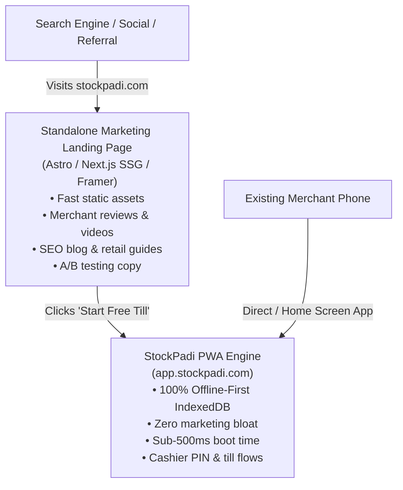

# Marketing Discovery, Reviews & Landing Page Architecture Spec

**Status:** Plan & Implementation Roadmap  
**Target Milestone:** Post-PWA Core (Growth & Acquisition Phase)  
**Governing Principles:** [zero-ai-slop-design.md](file:///c:/Users/ADMIN/Music/stockpadi/.agents/rules/zero-ai-slop-design.md), [reusability-and-multi-client.md](file:///c:/Users/ADMIN/Music/stockpadi/.agents/rules/reusability-and-multi-client.md)

---

## 1. Executive Summary & Goals

StockPadi is designed for physical retail merchants (grocery stores, pharmacies, electronics shops, general retail). To maximize user acquisition and organic discovery without compromising the ultra-fast, offline-first performance of the core POS engine, this document details:

1. **Standalone Landing Page Architecture (`stockpadi.com` vs `app.stockpadi.com`)**
2. **SEO & Google Search Console Organic Discovery Strategy**
3. **Merchant Reviews & Social Proof Flywheel**
4. **Implementation Roadmap**

---

## 2. Architecture: Separate Landing Page vs Unified Codebase

### Why a Standalone Codebase is Recommended:

| Dimension | Standalone Landing Page (`stockpadi.com`) | Integrated Single Codebase |
|---|---|---|
| **POS Performance** | **100% Preserved:** The PWA contains zero tracking pixels, hero video embeds, or heavy marketing CSS. | Risk of marketing scripts and heavy hero media inflating initial JS bundles for cashiers on budget Android phones. |
| **Marketing Agility** | Copy, testimonials, pricing, and campaign pages can be updated and deployed 10x/day without touching financial ledger code. | Every minor copy tweak requires running the full database migration and ledger build suite. |
| **SEO & Content Velocity** | Can use static SSG tools (Astro, Next.js SSG) with instant caching and rich blog support for educational content. | Service Worker caching rules for offline PWA can clash with dynamic marketing blog cache invalidation. |
| **Industry Standard** | Gold standard followed by **Square, Stripe, Linear, and Shopify** (`stripe.com` vs `dashboard.stripe.com`). | Monolithic coupling of marketing and mission-critical offline software. |

---

## 3. SEO Discovery & Google Search Console Optimization

### High-Intent Search Clusters (Nigerian & Emerging Retail)

1. **Point of Sale (POS):** *"free offline POS app"*, *"POS app for retail store"*, *"retail billing software without internet"*.
2. **Inventory Tracking:** *"inventory management app Nigeria"*, *"track shop stock on phone"*, *"grocery stock tracker"*.
3. **Debt & Ledger Management:** *"customer credit book app"*, *"track who owes money in shop"*, *"WhatsApp receipt generator"*.
4. **Daily Balancing:** *"daily cash drawer reconciliation"*, *"POS terminal and bank transfer balancing"*.

### Shipped Technical SEO Assets (Phase 1):

- **Dynamic Sitemap (`src/app/sitemap.ts`):** Serves `https://stockpadi.com/sitemap.xml` with priority weighting for high-converting routes (`/`, `/register`, `/login`).
- **Dynamic Robots Configuration (`src/app/robots.ts`):** Allows public crawlers while protecting private tenant paths (`/admin/`, `/work/`, `/business/`, `/auth/`).
- **Schema.org JSON-LD (`src/app/layout.tsx`):** Structured `WebApplication` metadata declaring zero-fee pricing (`₦0 NGN`), offline capability, and retail feature listings.
- **Search Metadata:** Replaced non-standard em dashes with search-standard pipes (`StockPadi | Free Offline POS & Inventory App`).

---

## 4. Merchant Review & Social Proof Flywheel

Word of mouth and peer validation are the #1 drivers of retail software adoption in West Africa.

### In-App Review Collector (Shipped in `src/app/(app)/settings/help/page.tsx`):
- **Interactive 5-Star Rating:** Integrated directly into Settings $\rightarrow$ Help & Support.
- **Direct WhatsApp Submission:** Formats merchant feedback and positive reviews into a 1-tap WhatsApp chat with the StockPadi team.
- **Google Play / Trustpilot Outbound Link:** Prepares users to rate the PWA when listed on app directories.

### Landing Page Social Proof Section (Phase 2):
1. **Merchant Spotlights:** 3 real retail profiles (e.g. *Supermarket Manager in Ikeja*, *Pharmacy Owner in Abuja*, *Electronics Trader in Alaba*).
2. **Concrete Proof Metrics:** *"₦0 Subscription Lockouts"*, *"Works on MTN/Airtel network drops"*, *"Takes 2 minutes to ring up your first sale"*.
3. **WhatsApp Receipt Demo:** Interactive mock receipt demonstrating how customer balance statements look on a customer's phone.

---

## 5. Implementation Roadmap

### Phase 1: In-App Discovery & Technical SEO (Completed ✅)
- [x] Dynamic `sitemap.xml` via `src/app/sitemap.ts`.
- [x] Dynamic `robots.txt` via `src/app/robots.ts`.
- [x] Schema.org `WebApplication` structured data in `src/app/layout.tsx`.
- [x] Brand name standardized to `StockPadi` across manifest and headers.
- [x] Interactive in-app review & feedback modal in `src/app/(app)/settings/help/page.tsx`.

### Phase 2: Standalone Landing Page Repository Setup (Upcoming)
- [ ] Initialize standalone repository (`stockpadi-marketing` or `stockpadi-landing`) using Next.js Static Export or Astro.
- [ ] Configure Vercel custom domains:
  - `stockpadi.com` $\rightarrow$ Marketing Landing Page
  - `app.stockpadi.com` $\rightarrow$ Core StockPadi Offline PWA
- [ ] Implement high-converting hero: Value proposition, interactive offline demo preview, merchant testimonials, FAQ accordion, and "Start Selling Free" button linking to `app.stockpadi.com/register`.
- [ ] Verify domain property inside **Google Search Console** and submit `sitemap.xml`.
